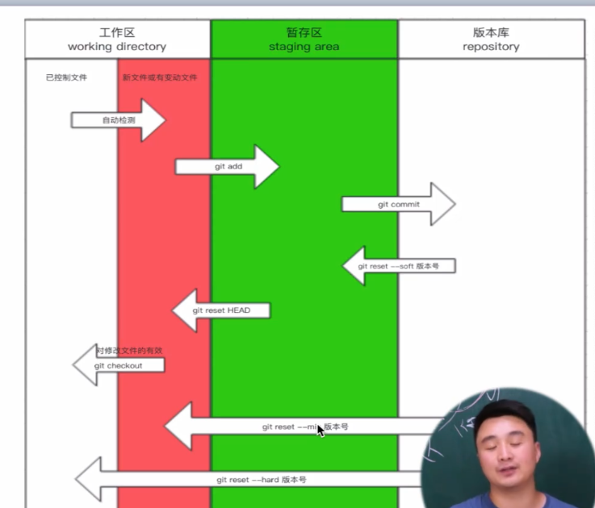
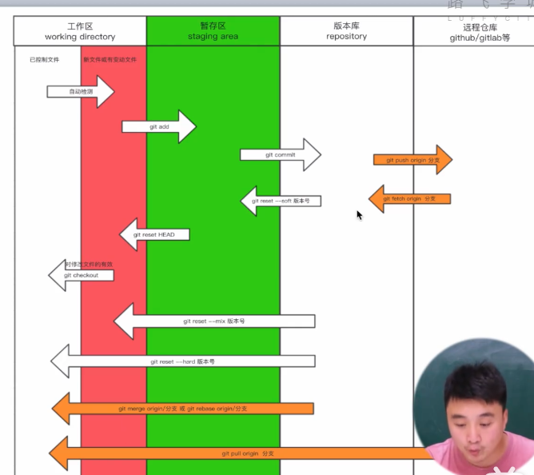

# Git实战

## 第一章 快速入门

### 1.1 什么是git

1. 文件夹拷贝
2. 本地版本控制
3. 集中式版本控制
4. 分布式版本控制

### 1.2 为什么要做版本控制

要保留之前所有的版本，以便回退和修改

### 1.3安装git

详见：[git安装教程]([Git - Book (git-scm.com)](http://git-scm.com/book/zh/v2))

### 1.4.Git配置

详见网站[git配置文件]([(14条消息) git中config配置的增删改查操作。_遇事不决，可问春风。-CSDN博客_git 删除config](https://blog.csdn.net/itdian666/article/details/79665530?spm=1001.2101.3001.6650.1&utm_medium=distribute.pc_relevant.none-task-blog-2~default~CTRLIST~default-1.highlightwordscore&depth_1-utm_source=distribute.pc_relevant.none-task-blog-2~default~CTRLIST~default-1.highlightwordscore))

1. 查看git config 配置列表：git config --list 或者简写 $ git config -l
2. 添加git config配置：git config --global 命名 '值'（如果这个命名存在也可以直接覆盖修改,还可以替换git config中已有的邮箱）
3. 删除命令：git config  --global --unset 命名

### 1.5基本操作

想要让git对一个目录进行版本控制需要以下几个步骤

1. 进入要管理的目录
2. git init 初始化，即：让git帮助我们管理当前文件夹
3. git status 监测当前目录下文件的状态
4. 三种状态的变化
   1. 红色：新增的文件/修改了原老文件   ——》git add 文件名/ git add .
   2. 绿色：git已经管理起来的文件 ——》git commit -m ‘描述信息’
   3. 生成版本
5. git commit -m '描述信息之前要指定用户和用户名'  【一次即可】
   1. git config --global user.email "your@examople.com"
   2. git config --global user.name "your name"
6. git log 查看版本记录

## 第二章 单枪匹马开始干

### 2.1 第一阶段：单枪匹马开始干

### 2.2拓展新功能

​	git add

​	git commit -m '描述信息'

### 2.3 版本回退

1. 回顾之前版本

​		git log

​		git reset --hard 版本号

2. 回滚之之后的版本

   git reflog

   git reset --hard 版本号

3. git checkout -- 文件名：把工作区已修改的文件回退到未修改状态
4. git reset head 文件名：暂存区回退到工作区
5. 

### 2.4总结

~~~
git init 
git add
git commit
git log
git reflog
git reset --hard 版本号
~~~

## 3. 创建分支

### 3.1分支

1. 主分支名称：master
2. 查看分支：git branch
3. 创建新分支：git branch 新分支名称
4. 切换到某一个分支：git checkout 分支名称
5. 将分支合并到主分支：
   		1. 切换master分支中（重要）
      		1. 执行：git merge 分支名称
6. 合并后的分支没用了，可以删除。
   1. 执行： git branch -d 分支名称
7. 开发新功能完成后，在合并到master分支，若在开发过程中，原master分支中的内容发生过变化，则会发生合并冲突。这时候需要手动修复，再提交（commit）

## 4.远程仓库

1. 给远程仓库起别名：git remote add origin 远程仓库地址（添加一遍就够了）
2. 向远程推送代码：git push -u origin 分支名称
3. 克隆远程仓库代码：git clone 远程仓库地址（内部已实现 git remote add origin 远程仓库地址）
4. 切换分支：git checkout 分支

​		在公司开发代码：

1. 切换到Dev分支进行开发： 
2. 把master分支合并到dev（仅一次）
3. 修改并提交代码到远程仓库

​		回到家中继续写代码

1. 切换到Dev分支进行开发： git checkout dev
2. 将远程仓库的代码更新到本地：git pull origin （dev）分支名称
3. 继续开发并提交代码

​		开发完毕，要上线

  		1. 将Dev分支合并到master，进行上线
       1. git checkout master
       2. git merge dev
       3. git push origin dev
  		2. 把dev分支也推送到远程仓库
       		1. git checkout dev
       		2. git merge master（好习惯）
       		3. git push origin dev

 